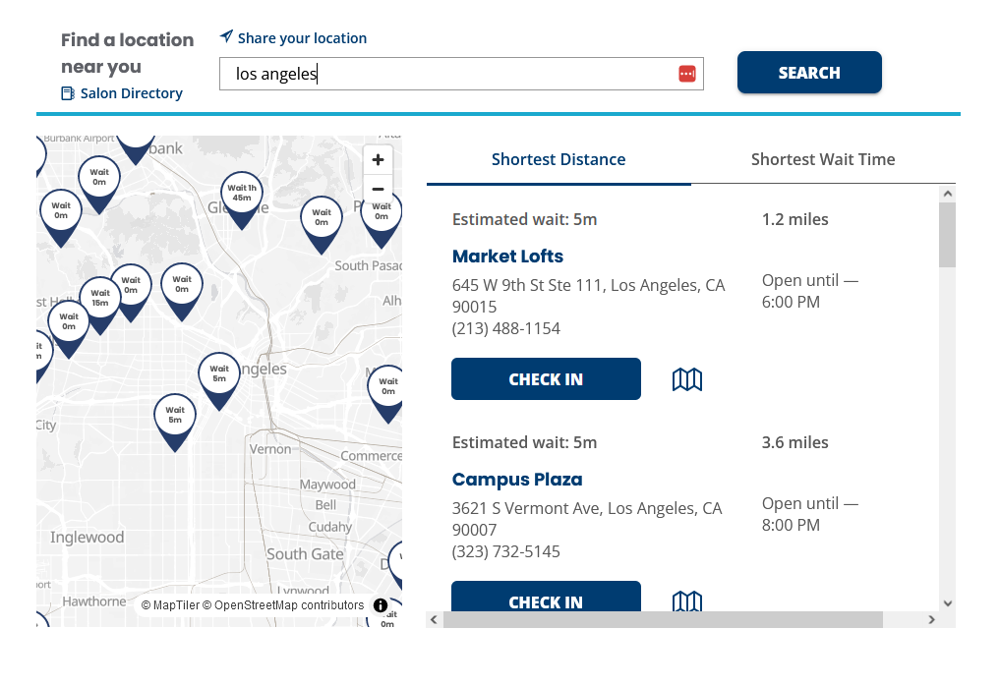
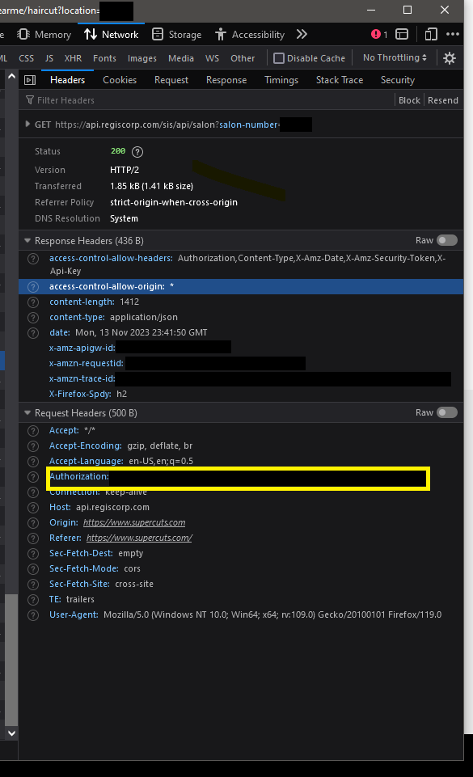
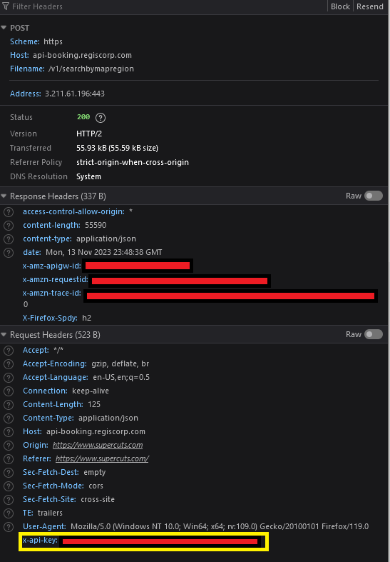

# openCuts 💇 - Automate your Haircuts

**`openCuts`** 💇 is an open-source Python library designed to interface with popular salons using public and private API's. It provides a common interface to the  [Zentoi](https://docs.zenoti.com/reference) (Supercuts), Regis (Supercuts) and StylewareTouch (Greatclips) API's to provide a seamless experience for retrieving salon services, scheduling appointments, and more. This is meant to be used to build future extensions for Home Assistant, Voice Assistants, etc.

This repo includes `supercuts-sli` which is small CLI program that allows you to book haricuts and other serivces at regis salons, and serves as an example of using this library.

## Disclaimer  ✂

<em>This project relies on private API's hosted by the Regis Corporation, Zenoti, and Greatclips for core functionality. This project is not endorsed or affiliated with those companies in any way. This is a private project not related to my {dayjob} and a completely independent work.

This is meant to be a light hearted attempt at solving a "first-world problem" (Automation of scheduling a hair cut) with Python for fun and learning. This is not meant to interfere with, replace, or degrade the services of any of the parent companies. Please do not use this library in a malicious way.  

This library can break at any time, as the companies can change the way their API functions, revoke the keys, or otherwise restrict the scope of programmatically interacting with their salons. </em>

## Currently Supported Salons 💈

- Supercuts
- Smartstyle
- Costcutters
- First  Choice Haircutters
- Roosters
- Pro-Cuts
- Holiday Hair
- Magicuts

## Future Salon Support

- Greatclips

## Features

- Retrieve salon services.
- Get stylists working at a specified salon on a given date.
- List people scheduled at the salon.
- Check available time slots for a combination of stylist and service.
- Schedule appointments.
- Cancel appointments.
- User account management (Create/Delete Account)
- View upcoming appointments for a user.

## Installation

- Clone this repo
- Use `pip` to install the requirements
- Copy the example configuration to a new file.

```bash
git clone https://github.com/nshores/openCuts.git
pip install requirements.txt
cp config-example config.ini
```

## API Key Retrival for Regis Salons (Supercuts, Etc)

- Although the API keys for this project are publicly available (In the `main.js` source code), I have chosen to not include them to reduce any potential liability.
- The API keys used for this project are embedded in the Regis Corporation salon websites source. (Supercuts, etc). To retrive the key:
  - Enable developer mode on your browser
    **Firefox Menu - Tools > Browser Tools > Web Developer Tools (or `CTRL+SHIFT+I`)**
    **Chrome Menu - More Tools > Developer tools (or `CTRL+SHIFT+I`)**
  - Navigate to the [salon search](https://www.supercuts.com/home) and search for any location  
    
  - In the developer console, find a GET reqeust like `https://api.regiscorp.com/sis/api/salon?salon-number=xxx`
  - Note the `authorization` header in the `headers` section. This is your `REGIS_API_KEY` 
  - In the developer console, find a POST reqeust like `https://api-booking.regiscorp.com/v1/searchbymapregion`
  - Note the `x-api-key` header in the `headers` section. This is your `REGIS_API_BOOKING_KEY` 

## Salon ID retrival

- The Salon ID can be found in the URL of any Salon:  
`https://www.supercuts.com/locations/nearme/haircut/CA/Los-Angeles/Hollywood-Blvd-And-Sunset/8876?location=los%20angeles`
- 8876 is the salon ID

## Configuration

Fill out the `config.ini` file with:

- The `api.regis.com` API Key obtained from their website

- The `api-booking.regis.com` API key obtained from their website
- Your local `Salon_ID` obtained from the website
- The rest of the required fields

```
[Opencuts]
#Required
salon_id = 12345
#Required
regis_api_key = abc123
#required
regis_booking_api_key = abc123

[Preferences]
#All fields below required
email = Edward.Scissorhands@gmail.com
first_name = Edward 
last_name = Scissorhands
phone_number = 5558675309
my_service = Supercut
# Optional, If no stylist selected - It will default to "Next Available"
my_stylist = Sweeney
```

## Super-Cuts CLI

`supercuts-cli` is a full fledged program meant to interactively and non-interactively create and manage user bookings at a Supercuts or other regis location. Support for non-interactive mode coming using only parameters for more automation potential.
  
Usage:

```
python3 supercuts-cli.py

openCuts is running! 💇

Salon Type: Zenoti
Store Info: MARKET LOFTS 645 W 9TH ST STE 111, LOS ANGELES, CA
My SALON_ID: 80925 
MY_SERVICE: Supercut
MY_STYLIST:


Main Menu:

1. Book an Appointment
2. View My Appointments
3. Cancel Appointment
4. View Store Services
5. View Store Stylists
6. Exit
Enter your choice (1-6): 
```

## Library Example Usage

To use the library, you will need an API key and salon ID at a minimum. Here's a quick example to get you started:

```python
import opencuts.opencuts as opencuts

SALON_ID = 1234
REGIS_API_KEY = abc123
REGIS_API_BOOKING_KEY = abc123
MY_STYLIST = 
MY_SERVICE = Supercut

# Instantiate the class and get some information about the salon
myStore = opencuts.RegisSalon(SALON_ID, REGIS_API_KEY)
myStore.get_salon()  # get salon information
myStore.get_salon_services()  # get all the services the salon offers
myStore.get_therapists_working()  # get the stylist information

# look up the ID for the stylist and service
selected_stylist = myStore.find_stylist_by_name(MY_STYLIST)
selected_service = myStore.find_service_by_name(MY_SERVICE)

# get some booking slots for the stylist and service selected
booking_id = myStore.create_service_booking(selected_service, selected_stylist)
booking_slots = myStore.get_booking_slot(booking_id)

# Show Store Services
print("\nStore Services:\n")
for service in myStore.store_services:
    print(f"Service Name: {service['catalog_info']['display_name']}, ID: {service['id']}\n")
# Show Store Stylists
print("Store Stylists")
for therapist in myStore.therapists:
    print(f"Stylist Name: {therapist['personal_info']['name']}, ID: {therapist['id']}\n")
```

## Contribution

Contributions to `openCuts` are welcome. Please ensure that your code adheres to the existing style and that all tests pass. For major changes, please open an issue first to discuss what you would like to change. If possible, I'd like to focus on adding more salons as the first order of business.

## License

This project is licensed under the MIT License - see the [LICENSE.md](LICENSE) file for details.
